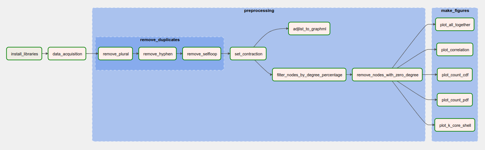

# Algorithms and Data Structures

## Introduction

This project aims to apply the concept of pipelines. A pipeline is a sequence of interconnected steps that are executed in order to process data or perform specific tasks. In the context of this project, the goal is to create a pipeline using Apache Airflow.

Apache Airflow is a workflow and scheduling platform that allows you to create, schedule, and monitor complex workflows. 

By using Airflow, you can create a Directed Acyclic Graph (DAG) to represent the desired pipeline.

## Docker
Docker is an open-source platform that enables developers to automate the deployment and scaling of applications inside lightweight, isolated containers. Containers provide a consistent and portable environment that encapsulates an application and its dependencies, allowing it to run on any system that has Docker installed, regardless of the underlying operating system.

To run this project you will need to install [Docker](https://www.docker.com/products/docker-desktop/) previously.

## Project architecture



## Running

1. Open the terminal or command prompt
2. Navigate to the directory where you wnat to clone the repository
3. Execute the following command:
    ```bash
    git clone https://github.com/DinizMaths/airflow-project.git
    ```
4. Change the directory:
    ```bash
    cd airflow-project
    ```
5. Now, up the containers with:
    ```bash
    docker-compose up -d
    ```
6. Go to [Link](https://localhost:8080)
7. Enter the credential:
    ```bash
    Username: airflow
    Password: airflow
    ```
8. Click at the play button in the **main_dag**
9. If you want to finish, remind to:
    ```bash
    docker-compose down
    ```